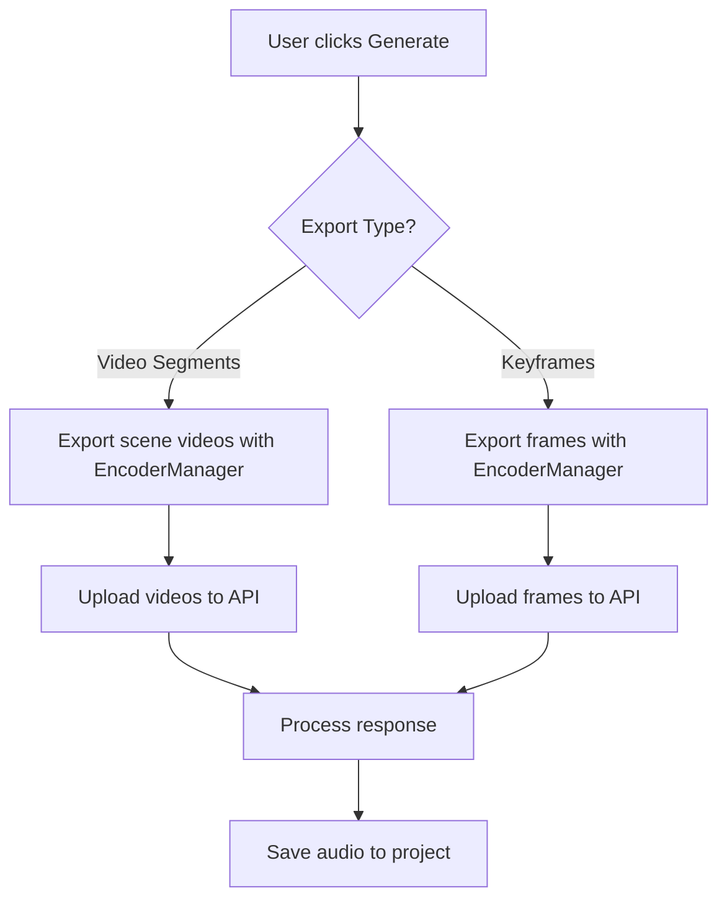

# Enhanced Premiere Pro Extension with EncoderManager

This enhanced version of the AI Soundscape Generator extension now uses Adobe Premiere Pro's **EncoderManager API** for robust frame and video export functionality.

## New Features

### 🎬 Video Segment Export
- **Generate from video segments**: Export short video clips (up to 10 seconds) from defined scenes
- **Better context**: Video segments provide more temporal context than individual frames
- **EncoderManager integration**: Uses the official EncoderManager API for reliable video export

### 🖼️ Improved Frame Export
- **EncoderManager priority**: Uses EncoderManager as the primary frame export method
- **Fallback strategies**: Multiple export strategies ensure maximum compatibility
- **Better error handling**: More detailed error messages and debugging information

## How It Works

### EncoderManager Integration

The extension now uses the **EncoderManager API** ([Adobe Documentation](https://developer.adobe.com/premiere-pro/uxp/ppro_reference/classes/encodermanager/)) with these export strategies:

1. **EncoderManager Frame Export**
   ```javascript
   const exportSettings = {
     exportType: ppro.EncoderManager.ExportType.FRAME,
     format: "JPG",
     outputPath: outputPath,
     width: 1920,
     height: 1080,
     useMaximumRenderQuality: true
   };
   ```

2. **EncoderManager Video Export**
   ```javascript
   const exportSettings = {
     exportType: ppro.EncoderManager.ExportType.VIDEO,
     format: "MP4",
     outputPath: outputPath,
     startTime: startTickTime,
     endTime: endTickTime
   };
   ```

3. **Legacy ppro.Exporter** (fallback)
4. **Placeholder images** (final fallback)

### Export Process Flow



## Usage

### Video Segment Workflow
1. **Define scenes**: Use "Set start" and "Set end" to define scene boundaries
2. **Generate from video**: Click "Generate from video segments" button
3. **Processing**: Extension exports video clips and sends them to the API
4. **Import**: Generated audio clips are automatically imported to project

### Frame-based Workflow  
1. **Mark keyframes**: Use "Mark current playhead" to mark salient moments
2. **Generate from frames**: Click "Generate from keyframes" button
3. **Processing**: Extension exports individual frames and sends them to the API
4. **Import**: Generated audio clips are automatically imported to project

## API Compatibility

The extension works with your existing FastAPI backend (`fastapi_app.py`) which supports:
- ✅ **Multiple file formats**: JPG, PNG, MP4
- ✅ **QwenVL processing**: Fixed file URI issues
- ✅ **Audio generation**: AudioLDM2 synthesis
- ✅ **Similarity search**: PANN embeddings

## Troubleshooting

### EncoderManager Not Available
If EncoderManager isn't available, the extension will:
1. Fall back to legacy `ppro.Exporter.exportSequenceFrame`
2. Create placeholder images as a last resort
3. Provide detailed error messages

### Permission Issues
Ensure your `manifest.json` includes:
```json
{
  "requiredPermissions": {
    "localFileSystem": "request",
    "webExecution": "request",
    "network": { "domains": "all" },
    "launchProcess": { "schemes": ["https"] },
    "ipc": { "enablePluginCommunication": true }
  }
}
```

### Video Export Issues
- **Large files**: Video segments are limited to 10 seconds to prevent timeout
- **Codec support**: Uses H.264 MP4 for maximum compatibility
- **Quality settings**: Uses maximum render quality for best results

## Technical Details

### Export Settings
- **Frame Resolution**: 1920x1080 (configurable)
- **Video Format**: MP4 with H.264
- **Frame Formats**: JPG (primary), PNG, TIF (fallbacks)
- **Max Segment Duration**: 10 seconds
- **Timeout**: 10 minutes for video, 5 minutes for frames

### File Management
- **Temporary files**: Created in `plugin-temp://` or `plugin-data://`
- **Automatic cleanup**: Temp files removed after processing
- **Error recovery**: Partial exports don't block other operations

## Future Enhancements

- **Batch processing**: Export multiple scenes simultaneously
- **Custom export presets**: User-configurable quality settings
- **Progress indicators**: Real-time export progress
- **Preview functionality**: Preview exported content before sending to API

---

This enhanced extension provides a much more robust integration with Premiere Pro's export capabilities, making it easier to generate contextual audio content for your video projects!